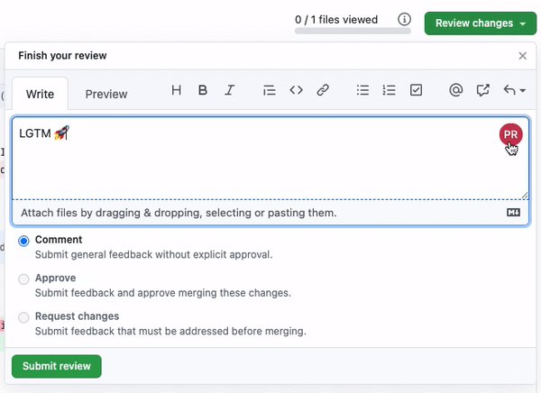
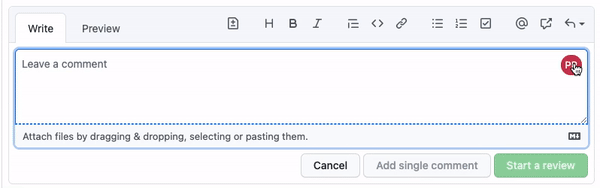

# PRaise

Chrome Extension for giving praise to GitHub PRs with one click.

**Reviews**

**Comments**

## Installation

To use the alpha version please follow the following steps.

1. Clone this repo.
2. `npm install`
3. `npm run build`
4. Open Chrome -> Manage Extensions
5. Enable Developer Mode on the top right
6. Click on "Load Packed"
7. Select the `dist` of this project folder.
8. Happy praising 👏
